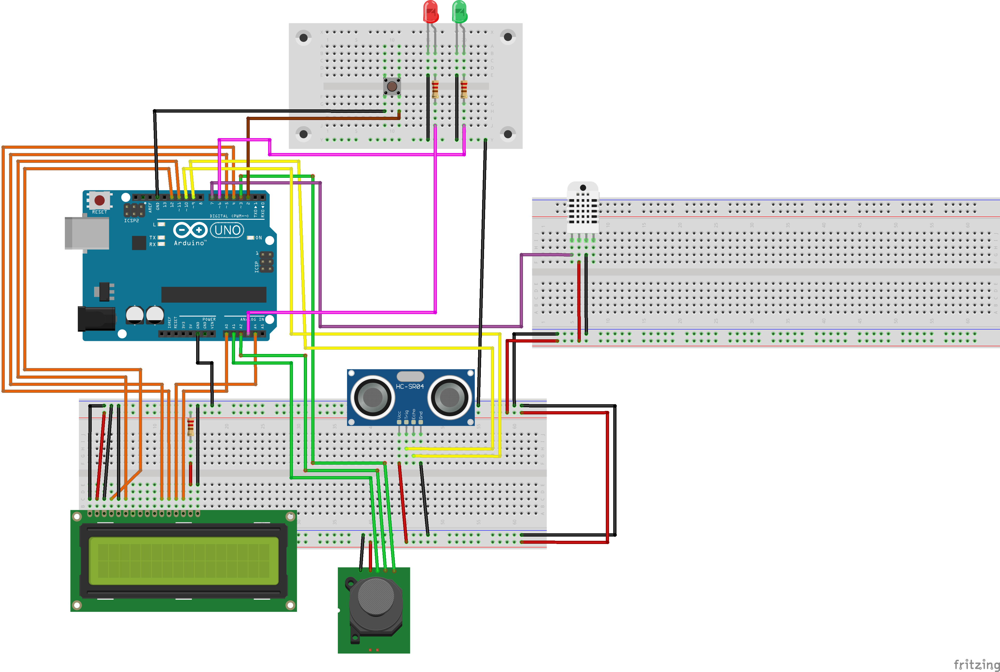

## 1. Introducción
[Descargar PDF del enunciado](Practica3.pdf)

## 2. Hardware y conexiones

## 3. Software y lógica de la máquina

### 3.1. Arduino Threads

### 3.2. Interrupciones

### 3.3. Watchdog

## 4. Mejoras propuestas

## 5. Vídeo de la práctica
[Ver vídeo en OneDrive](https://urjc-my.sharepoint.com/:v:/g/personal/m_morenop_2023_alumnos_urjc_es/EeLNrl9QJYRFtV53lmoKBi8B_34nmYmKUG5nxV45irWA-g?e=UiL2rU)

## 6. Repositorio

El código fuente del proyecto se hará público una vez concluida la asignatura.
